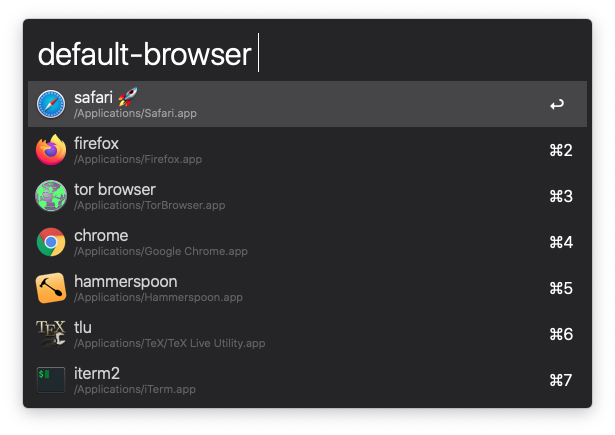

# macOS Default Browser CLI and Alfred Workflow 💻 🌍

A Swift CLI and accompanying Alfred workflow to change the default web browser on macOS.

## 🏗 Installation

### Alfred Workflow

Download the `default-browser.alfredworkflow` file from the [latest release](https://github.com/dnlggr/DefaultBrowser/releases/latest) and open it once downloaded.

⚠️ The Alfred workflow needs the `default-browser` CLI installed on your system.

### CLI

The easiest way to install the `default-browser` CLI is by running:

``` bash
brew install dnlggr/tap/default-browser
```

## ⌨️ Alfred Workflow Usage

The workflow is triggerd by the keyword `default-browser`.
It will show you a list of available browsers from which you can select your new default browser from.
The current default will be marked with a 🚀.



## 🚀 CLI Usage

You can change your default web browser, list all available browsers, and list the current default browser.

### Set Default Web Browser

To set the default web browser, run:

```
default-browser set <browser>
```

Some common examples for `<browser>` are: `safari`, `chrome`, `firefox`, etc.

For example, to set the default web browser to Firefox, run:

```
default-browser set firefox
```

### Advanced Usage

Refer to the CLI's help message for advanced usage information.

```
OVERVIEW: Manages the system's default web browser.

USAGE: default-browser <subcommand>

OPTIONS:
  -h, --help              Show help information.

SUBCOMMANDS:
  set                     Sets the default browser.
  list                    Lists the available browsers.
  current                 Lists the current default browser.

  See 'default-browser help <subcommand>' for detailed help.
```

## 🤓 Contributing

Feel free to share ideas and criticism or open pull requests.

## 👏 Attribution

There is already a similar CLI available via brew: [kerma/defaultbrowser](https://github.com/kerma/defaultbrowser).
The purpose of this little project was mainly for me to get a chance to play around with Swift Package Manager.
I already wrote the code to change the default web browser a couple of years ago for a different project (see version [1.0.0](https://github.com/dnlggr/DefaultBrowser/releases/tag/1.0.0)).
